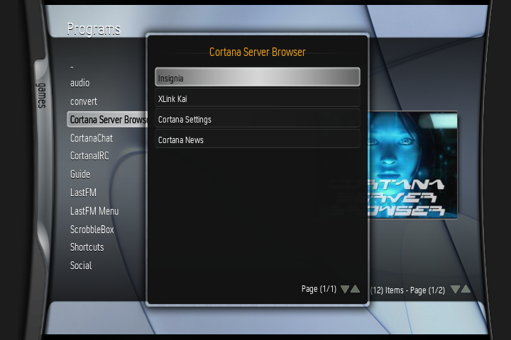
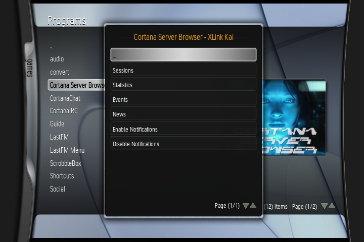
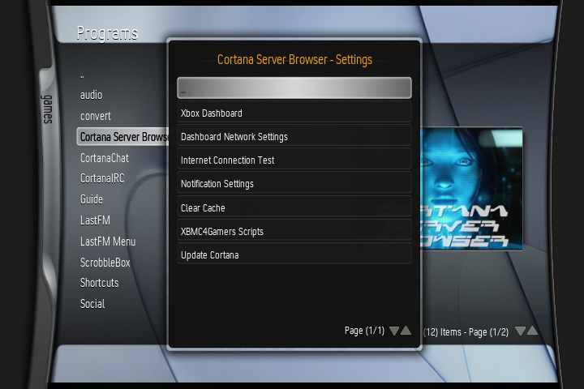
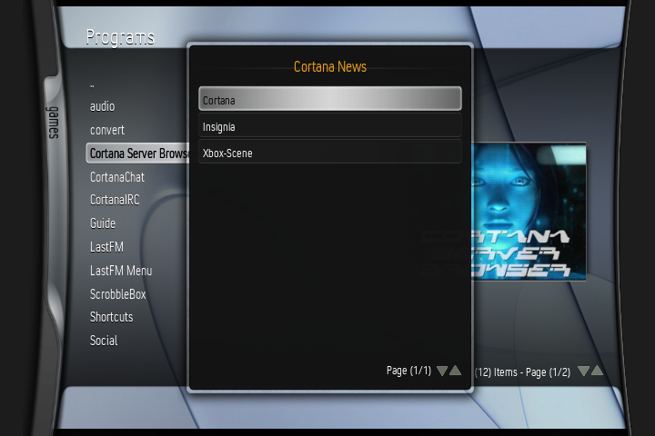
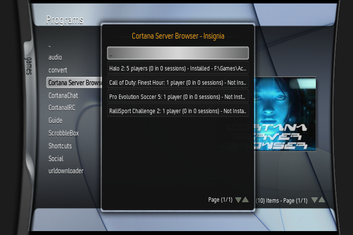
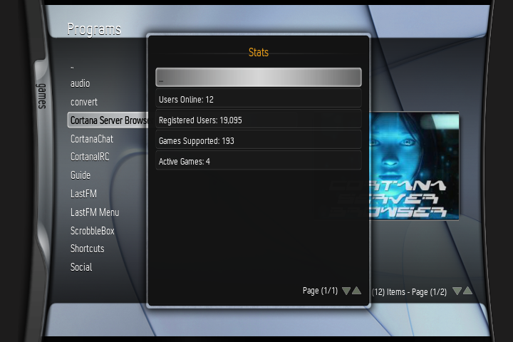
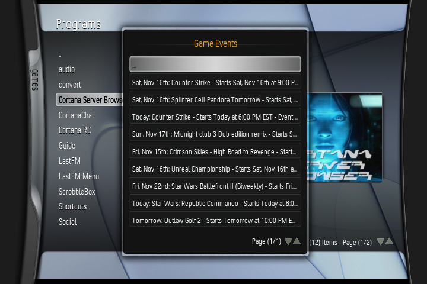
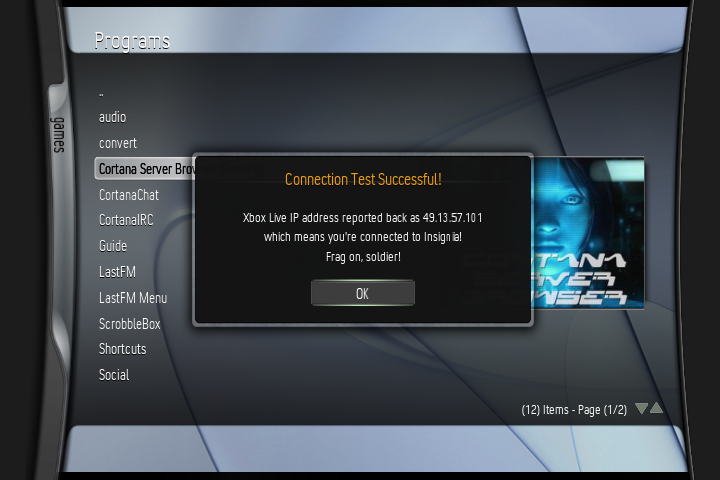

# Cortana Server Browser
An XBMC script that shows how many players are logged into Insignia and XLink Kai, which games are being played, and upcoming events. Made as part of "Cortana", an XBMC overhaul, but can be used as a standalone script perfectly.

## Screenshots:

## Features:
- View current XLink Kai and Insignia matches in an instant with a friendly, easy-to-use pop-up window!
- See a game popping off that you really want to join? Click on the game session you'd like to join, locate your game's directory if you haven't already, and you'll be able to immediately launch into that game any time you're in the browser!
- Browse Insignia / XLink Kai statistics, game events, and news!
- Toast (pop-up) notifications for new Insignia sessions, which can be enabled/disabled in the Insignia Settings menu (and even enabled on startup!) Now you'll never have to worry about missing a match!
- Comes with "Insignia Connection Test", a utility which makes sure your DNS is correctly set to Insignia's.
- Not registered to Insignia yet? Select "Insignia Setup" and the script will automatically download and launch the [Insignia Setup Assistant](https://insignia.live/connect)!
- Built-in Cortana update utility! No PC needed! (Coming Soon!)

## Installation:
- **Make sure your XBMC4Xbox settings are set to "Dashboard"!** XBMC4Gamers users don't have to worry about this as there's a DNS1 and DNS2 option, but XBMC4XBox by default only uses DNS1, which is usually set to Insignia, and won't allow you to connect to the rest of the internet. This should be fixed with the next X4X release!
- Copy the "Cortana Server Browser" folder into your "Q:\scripts" folder. Make sure you use the **latest release .zip** and **NOT** files from the repository, as the repository files are almost always very unstable due to being half-updated!
- Go into your Scripts menu in XBMC and select "Cortana Server Browser".
- Select the server of your choice.
- ???
- Profit.

## Bugs: 
- Notifier has a 1/60 chance per minute of crashing when a game is launched outside of CSB. Not sure how to rectify it. It's rare, but it CAN happen, so listing it as a bug here.
- Sometimes game events don't show up the first time. This doesn't seem to be XBMC-specific, as this happens when loading the RSS feed in my PC's browser too. Just try loading it again and it should work.
- If a "Session" menu is empty, don't panic! It most likely means nobody's playing right now, or that your network isn't reaching the servers properly. Double-check the Insignia/XLink Kai websites on another device to verify this.
- You tell me.

## TODO:
- [Restore lost XLink Kai functionality by re-implememting Kai Engine HTTP API features](https://github.com/faithvoid/script.xlinkrevived)
- Add more useful utilities.
- Reintroduce update feature (need stable domain name first).

## FAQ: 
- "Does this work on XBMC4Gamers?"

It does, but for Insignia you're better off using Rocky5's new Insignia Sessions feature in X4G for a more seamless experience! 

- "Will this come to (insert non-XBMC dashboard name here)?"

No, sorry! I wish!  Every piece of this code relies heavily on XBMC's Python implementation (including XBMC-specific code like dialogOk windows). You can feel free to make a homebrew application based on it if you want, but I won't be supporting non-XBMC dashboards. After all, it mostly just uses the OGXbox RSS feed and some clever scripting to launch XBEs!

- "What's the point of this script, can't you just check these stats on your PC/Phone? Why support such an old piece of hardware?"

Because the Xbox is genuinely one of the best consoles of all time, and had groundbreaking multiplayer features at the time. With the rise of projects like Insignia, I want to do what I can help players hop into the action immediately and grab all relevant information at a glance, without having to check their PC or phone, as some players mentioned not having consistent access to devices that weren't their Xbox or other video game consoles. I want to lower the barrier to entry for people and see plenty of new, friendly faces in-game!

- "Why am I not getting notifications?"

The Insignia notifier won't notify you of active sessions if a game says (0 in 0 sessions), and if the RSS detects the same information it displayed last time, it won't show it until it changes again! This is to make sure you don't get spammed by non-active games and sessions you've already seen every minute. 

## Credits:
- Insignia Team - For reviving one of the best multiplayer services of all time.
- Team XLink - For being the original free console multiplayer service! I lost many hours of my younger years playing Halo over XLink Kai and I'm glad the service is still running and still free!
- XBMC4Xbox Team - For making an incredibly useful and flexible dashboard for the original Xbox!
- OGXbox Team - For their Insignia & XLink Kai RSS feeds that this scrapes from!
- antonic901 - For letting me know that the latest XBMC trunk supports a newer version of OpenSSL & TLS 1.2!
- umbral_shadows - Initial alpha testing!
- Crunchbite - For giving additional documentation on XLink Kai!
